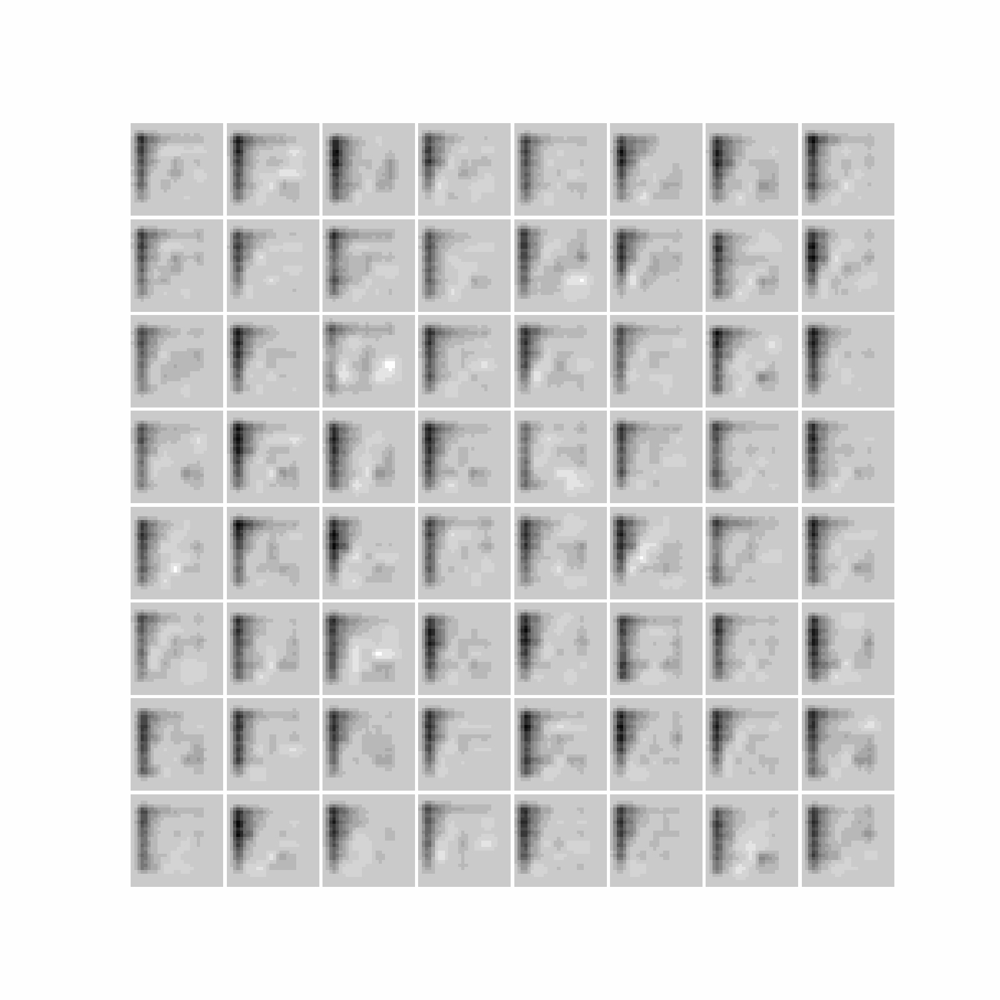
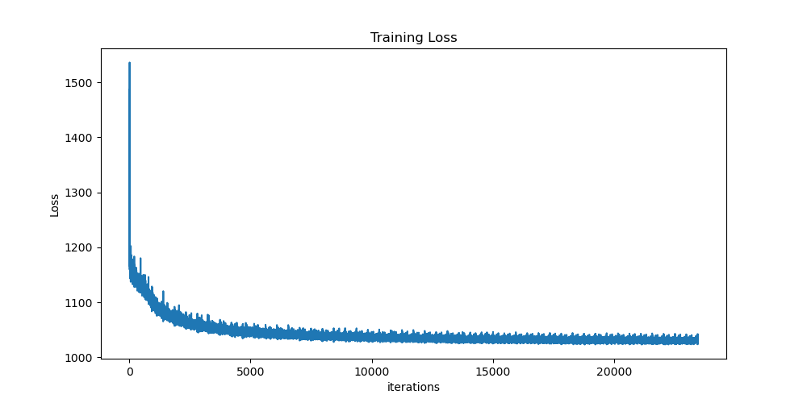

# alignDRAW
PyTorch implementation of [Generating Images from Captions with Attention](http://arxiv.org/abs/1511.02793).
<p align="center">


</p>

## Training
<!-- Download the data and place it in the **data/** directory. Run **`train.py`** to start training. To change the hyperparameters of the network, update the values in the `param` dictionary in `train.py`. -->

To train the model with MNIST data, run

```
python train.py --dataset_name mnist --input_image_size 28 --n_channels 1 --run_idx 0
```

To train the model with MS-COCO data, run

```
bash run_coco_train.sh
```

To train the model with MNIST-Captions data, run

```
python train.py --dataset_name mnist_captions --input_image_size 28 --n_channels 1 --run_idx 0
```

**Loss Curve**

Results on MNIST dataset
<p align="center">

</p>

# Sections below are WIP


## Generating New Images
To generate new images run **`generate.py`**.
```sh
python3 evaluate.py -load_path /path/to/pth/checkpoint -num_output n
```
The checkpoint file for the model trained for 50 epochs is present in **checkpoint/** directory.

## Results
<table align='center'>
<tr align='center'>
<th> Devanagari Training Data </th>
<th> Generated Devanagari After 50 Epochs</th>
</tr>
<tr>
<td>
<td>
</tr>
</table>
<table align='center'>
<tr align='center'>
<th> Devanagari Numbers Only Training Data </th>
<th> Generated Devanagari Numbers After 50 Epochs</th>
</tr>
<tr>
<td>
<td>
</tr>
</table>

### Some more generated images:


## References
1. [Generating Images from Captions with Attention](http://arxiv.org/abs/1511.02793)
2. **Karol Gregor, Ivo Danihelka, Alex Graves, Danilo Jimenez Rezende, Daan Wierstra.** *DRAW: A Recurrent Neural Network For Image Generation.* [[arxiv](https://arxiv.org/abs/1502.04623)]
3. **ericjang/draw** [[repo](https://github.com/ericjang/draw)]
4. **What is DRAW (Deep Recurrent Attentive Writer)?** [[blog](http://kvfrans.com/what-is-draw-deep-recurrent-attentive-writer/)]

## Data
The Devanagari Character dataset is available on kaggle. ([Source](https://www.kaggle.com/rishianand/devanagari-character-set))
